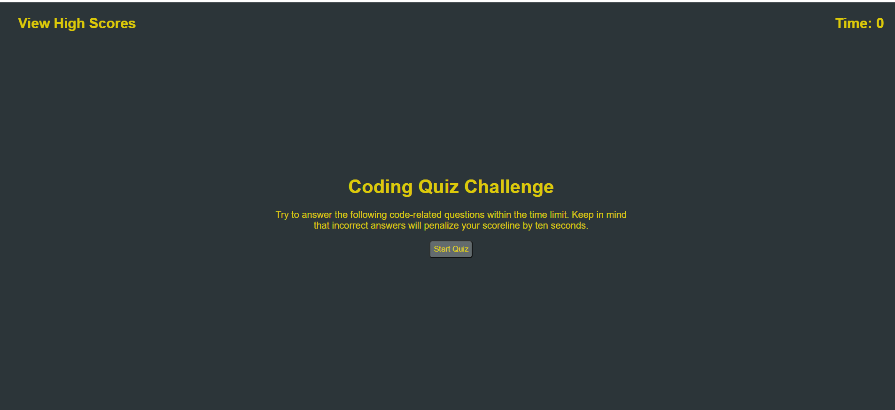
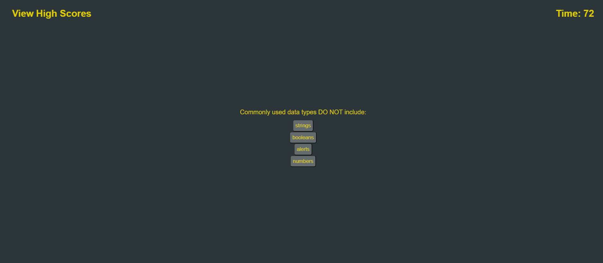
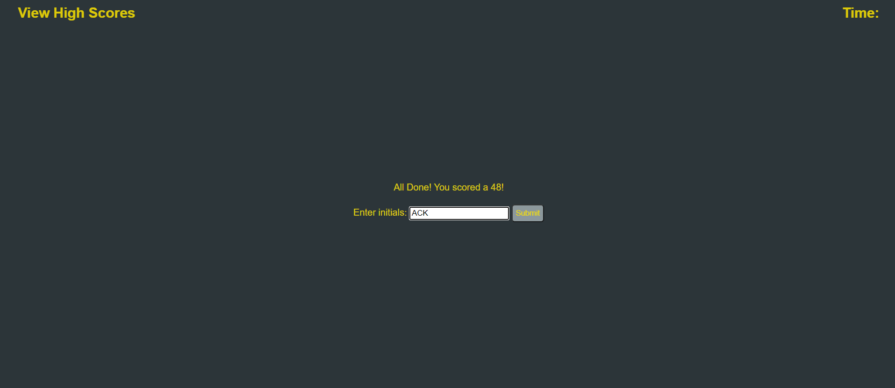
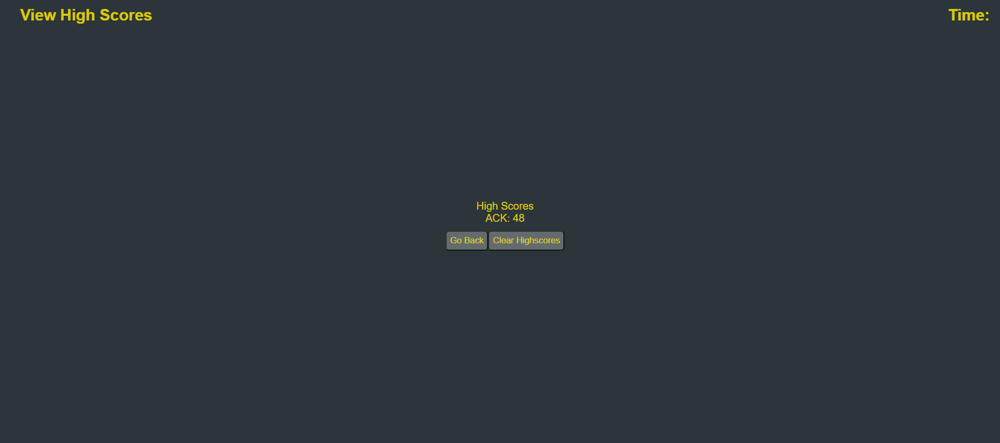

# Coding-Quiz

## Description

This is a coding quiz application. The quiz runs a script of questions that will populate for the user to then answer while competing against a timer.

If the questions are answered correctly, the script moves on to the next question, but an incorrect submission will result in a ten second penalty to the timer.

Once all the questions are complete, the final score will be the remaining time left on the timer. The user can then log this with their initals to a high scores page which can be recalled with the local storage.

This application is very versatile because it can be tailored to any sort of quiz. Right now its questions and answers surround coding, but this can be used for a variety of other subjects. You just need to load up the questions!

## Table of Contents

- [Development](#development)
- [Installation](#installation)
- [Usage](#usage)
- [License](#license)

## Development

1. I first identified all the possible inputs and outputs I would need for the my html file. I
2. I then went and did some coding in CSS to make the menus and layout look the way I wanted
3. Then I had to write code using javascript to define the differnt functions that would load on start up and based on click actions
4. I then worked on debugging the program by testing pressing buttons in multiple variations to make sure the program could still work after certain sequences of functions

## Installation

To install this project, download the files from my repository at https://github.com/AndrewKamSki/Coding-Quiz. From there you can load in the html 
file in your favorite IDE along with the corresponding CSS and JS files. To see what the file looks like in a browser, open the index.html file in your browser.

## Usage

To use this tool for yourself, visit the depoloyed landing page at https://andrewkamski.github.io/Coding-Quiz/.

To start, click the 'Start Quiz' button. From there it will prompt you 5 different questions. Answer them quickly and accurately for your highest score!

Once completed, you can log you scores to the localStorage for future reference.

If you want to implement your own quiz questions and answers, edit the quizArray in the JS code. Type in your questions and answer selections, just make sure to indicate that the correct answer has a boolean value of true in it's answerResult object.

Here's a couple of screenshots of the quiz start page, questions and score logging!

## License
MIT License

Copyright (c) [2022] [Andrew Kaminski]

Permission is hereby granted, free of charge, to any person obtaining a copy
of this software and associated documentation files (the "Software"), to deal
in the Software without restriction, including without limitation the rights
to use, copy, modify, merge, publish, distribute, sublicense, and/or sell
copies of the Software, and to permit persons to whom the Software is
furnished to do so, subject to the following conditions:

The above copyright notice and this permission notice shall be included in all
copies or substantial portions of the Software.

THE SOFTWARE IS PROVIDED "AS IS", WITHOUT WARRANTY OF ANY KIND, EXPRESS OR
IMPLIED, INCLUDING BUT NOT LIMITED TO THE WARRANTIES OF MERCHANTABILITY,
FITNESS FOR A PARTICULAR PURPOSE AND NONINFRINGEMENT. IN NO EVENT SHALL THE
AUTHORS OR COPYRIGHT HOLDERS BE LIABLE FOR ANY CLAIM, DAMAGES OR OTHER
LIABILITY, WHETHER IN AN ACTION OF CONTRACT, TORT OR OTHERWISE, ARISING FROM,
OUT OF OR IN CONNECTION WITH THE SOFTWARE OR THE USE OR OTHER DEALINGS IN THE
SOFTWARE.

## Future Development

The application could use a little cleanup on spacing/ styling, etc. Just not sure if I like the current scheme, but I wanted to get the app working first.

Some extra things could be added to make it a little harder and less of a memory game for someone that is taking the quiz for a second time. I could try to implement some random functions to randomize the order of the question and the order of the answer buttons.